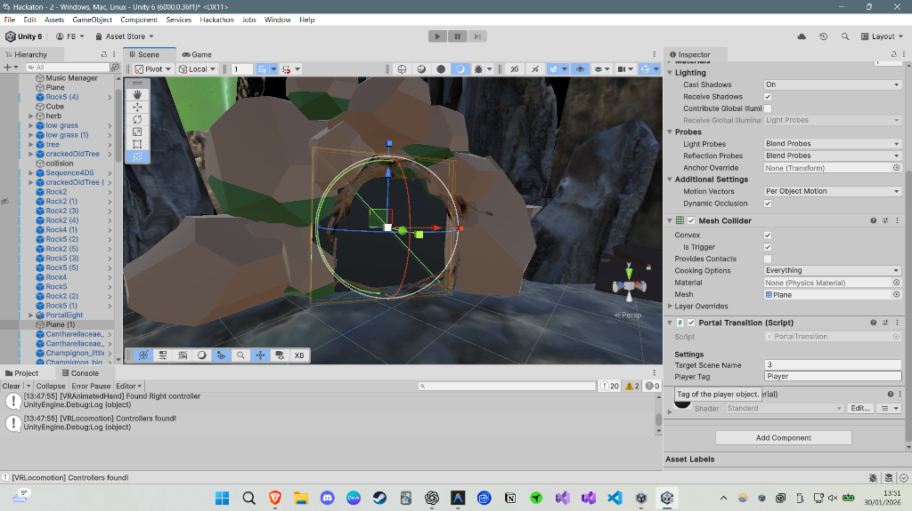

# Arthur et les Mini'me VR


Projet réalisé dans le cadre d'un Hackathon de 1,5 jours lors d'un séminaire chez CLARTE à Laval, pour l'option InfoRV de Centrale Nantes.

## L'Équipe
- Narjisse
- Cheikhou Oumar
- Florian

## Le Projet
Plongez dans l'univers d'Arthur et les Minimoys à travers une expérience VR unique explorant différentes échelles.
Le joueur doit naviguer dans l'environnement en utilisant différentes formes pour résoudre des énigmes et progresser dans l'histoire.

### Galerie


### Mécaniques de Jeu

#### Forme Humaine
- **Exploration** : Déplacez-vous dans un environnement à taille humaine.
- **Interactions** : Manipulez des objets comme une lampe torche (FlashlightController) pour éclairer les zones sombres.
- **Narration** : Suivez l'histoire via un Livre Interactif (BookLogic) qui guide le joueur.

#### Forme Abeille (Bee)
- **Vol** : Prenez votre envol et explorez la pièce depuis les airs (BeePlayerController).
- **Interaction** : Collectez du pollen et atteignez des zones inaccessibles aux humains.
- **Monture** : Chevauchez une abeille géante pour des déplacements rapides (BeeRideSystem).



#### Forme Araignée (Spider)
- **Déplacement** : Faufilez-vous au sol et dans les petits recoins (SpiderPlayerController).
- **Grimpe** : Utilisez vos capacités d'araignée pour naviguer sur des surfaces complexes.
- **Interaction Spécifique** : Interagissez avec l'environnement d'une manière unique à votre petite taille (SpiderInteraction).


## Installation & Démarrage

### Prérequis
- Unity 6000.0.36f1 (Version exacte requise)
- Casque VR compatible (Oculus Quest, HTC Vive, Valve Index, WMR)
- Runtime OpenXR actif (Oculus App ou SteamVR)

### Lancer le projet
1.  Cloner ce dépôt :
    ```bash
    git clone https://github.com/FlorianBarbe/Arthur-et-les-Mini-me-VR.git
    ```
2.  Ouvrir le projet avec Unity Hub (Version 6000.0.36f1).
3.  Connecter votre casque VR.
4.  Ouvrir la scène principale : `Assets/Scenes/VRScene.unity`.
5.  Appuyer sur Play !

## Structure du Projet
- `Assets/Scripts/Gameplay` : Logique de jeu (Abeille, Araignée, Livre).
- `Assets/Scripts/VR` : Gestion de la VR, locomotions et interactions.
- `Assets/Scripts/Core` : Gestion globale du jeu.

---
Projet développé à Laval, France - Janvier 2026
